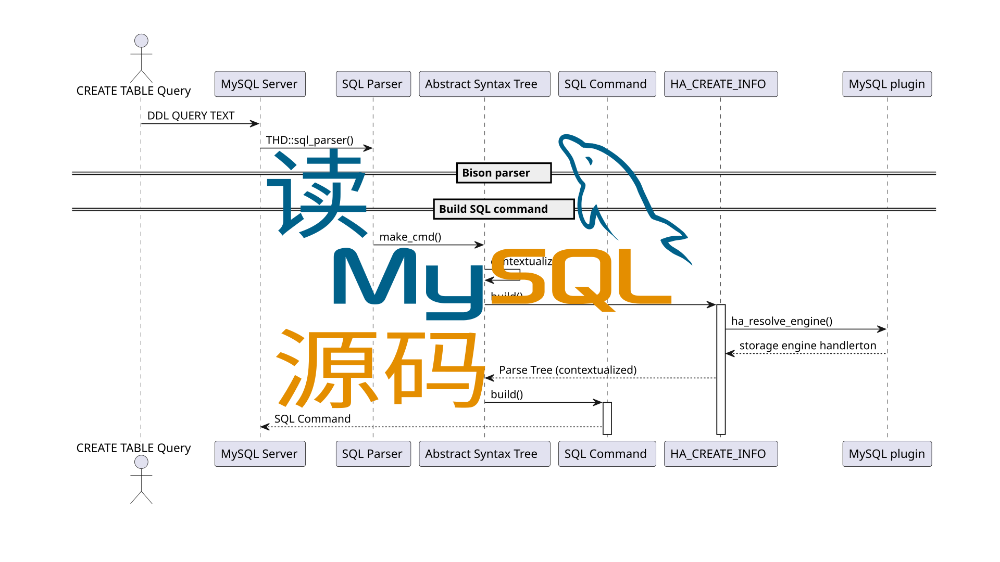

#+TITLE:【更新中】🐬 读 MySQL 源码
#+AUTHOR: Jinghui Hu
#+EMAIL: hujinghui@buaa.edu.cn
#+DATE: <2024-05-06 Mon>
#+STARTUP: overview num indent
#+OPTIONS: ^:nil

* 快速链接
1. 课程主页 | [[https://github.com/Jeanhwea/mysql-source-course][github]] | [[https://gitee.com/jeanhwea/mysql-source-course][gitee]]
2. 源码仓库 | [[https://github.com/Jeanhwea/mysql-server][github]] | [[https://gitee.com/jeanhwea/mysql-server][gitee]]
3. 视频讲解 | [[https://www.bilibili.com/cheese/play/ss19642][bilibili]]
4. ibr 工具 | [[https://github.com/Jeanhwea/innobase_reader][source]] | [[https://github.com/Jeanhwea/innobase_reader/releases][release]] | [[https://read0code.github.io/pub/ibr/ibr/index.html][doc]]

* 课程安排
** 课程大纲
- 课程预计时间 <2024-05-06 Mon> 至 <2026-10-24 Sat>
| Timeline         | Topic                                    | Slide & Note | Video |
|------------------+------------------------------------------+--------------+-------|
| <2024-05-06 Mon> | 关系型数据库管理系统绪论                 | [[file:slides/p01-introduction-to-RDMS.pdf][p01]]          | [[https://www.bilibili.com/cheese/play/ep676075][v01]]   |
| <2024-05-08 Wed> | 源码构建 MySQL 调试环境                  | [[file:slides/p02-build-mysql-from-source.pdf][p02]]          | [[https://www.bilibili.com/cheese/play/ep683149][v02]]   |
| <2024-05-10 Fri> | MySQL 系统架构及模块功能概述             | [[file:slides/p03-mysql-architecture.pdf][p03]]          | [[https://www.bilibili.com/cheese/play/ep693532][v03]]   |
| <2024-05-15 Wed> | MySQL 服务启动源码分析                   | [[file:slides/p04-mysql-startup.pdf][p04]]          | [[https://www.bilibili.com/cheese/play/ep704954][v04]]   |
| <2024-05-20 Mon> | MySQL 的线程模型                         | [[file:slides/p05-mysql-thread-model.pdf][p05]]          | [[https://www.bilibili.com/cheese/play/ep725138][v05]]   |
| <2024-05-23 Thu> | 服务层组件连接器的设计与实现             | [[file:slides/p06-server-connection-manager.pdf][p06]]          | [[https://www.bilibili.com/cheese/play/ep731978][v06]]   |
| <2024-05-28 Tue> | 服务层组件线程管理和用户模块             | [[file:slides/p07-server-thd-manager.pdf][p07]]          | [[https://www.bilibili.com/cheese/play/ep740625][v07]]   |
| <2024-05-30 Thu> | 网络模块和派发模块                       | [[file:slides/p08-net-dispatch-command.pdf][p08]]          | [[https://www.bilibili.com/cheese/play/ep746335][v08]]   |
| <2024-06-04 Tue> | MySQL 词法分析器的设计与实现             | [[file:slides/p09-lexical-scanner.pdf][p09]]          | [[https://www.bilibili.com/cheese/play/ep759933][v09]]   |
| <2024-06-06 Thu> | MySQL 语法分析器的设计与实现             | [[file:slides/p10-syntax-parser.pdf][p10]]          | [[https://www.bilibili.com/cheese/play/ep764493][v10]]   |
| <2024-06-12 Wed> | 遍历解析树上下文构建词法单元             | [[file:slides/p11-contextualize-parse-tree.pdf][p11]]          | [[https://www.bilibili.com/cheese/play/ep785171][v11]]   |
| <2024-06-15 Sat> | MySQL 优化器功能概述及其观测工具         | [[file:slides/p12-introduction-to-optimizer.pdf][p12]]          | [[https://www.bilibili.com/cheese/play/ep795203][v12]]   |
| <2024-06-20 Thu> | 准备阶段 Rewrite 和 Prepare 设计与实现   | [[file:slides/p13-rewrite-and-prepare.pdf][p13]]          | [[https://www.bilibili.com/cheese/play/ep813796][v13]]   |
| <2024-06-23 Sun> | 进入优化器和优化器追踪日志实现           | [[file:slides/p14-enter-optimizer.pdf][p14]]          | [[https://www.bilibili.com/cheese/play/ep820168][v14]]   |
| <2024-06-27 Thu> | 代价模型和优化模块的设计与实现           | [[file:slides/p15-optimizer-and-cost-model.pdf][p15]]          | [[https://www.bilibili.com/cheese/play/ep834530][v15]]   |
| <2024-06-29 Sat> | 联表查询 Join 优化器的设计与实现         | [[file:slides/p16-join-order-optimizer.pdf][p16]]          | [[https://www.bilibili.com/cheese/play/ep838693][v16]]   |
| <2024-07-04 Thu> | 子查询优化器的设计与实现                 | [[file:slides/p17-subquery-optimizer.pdf][p17]]          | [[https://www.bilibili.com/cheese/play/ep853672][v17]]   |
| <2024-07-09 Tue> | MySQL 执行器的设计与实现                 | [[file:slides/p18-enter-executor.pdf][p18]]          | [[https://www.bilibili.com/cheese/play/ep869070][v18]]   |
| <2024-07-22 Mon> | 性能分析及 handlerton 存储引擎接口设计   | [[file:slides/p19-profile-handlerton.pdf][p19]]          | [[https://www.bilibili.com/cheese/play/ep913384][v19]]   |
| <2024-08-01 Thu> | InnoDB 存储引擎数据文件和分页机制        | [[file:slides/p20-innodb-datafile.pdf][p20]]          | [[https://www.bilibili.com/cheese/play/ep950258][v20]]   |
| <2024-08-06 Tue> | InnoDB 存储引擎的行记录格式              | [[file:slides/p21-innodb-row-format.pdf][p21]]          | [[https://www.bilibili.com/cheese/play/ep965657][v21]]   |
| <2024-08-12 Mon> | INDEX 数据页案例研究和 ibr 工具介绍      | [[file:slides/p22-innobase-reader-cli.pdf][p22]] / [[file:notes/n22.pdf][n22]]    | [[https://www.bilibili.com/cheese/play/ep982336][v22]]   |
| <2024-08-14 Wed> | InnoDB 行记录格式的演进过程              | [[file:slides/p23-parse-record.pdf][p23]] / [[file:notes/n23.pdf][n23]]    | [[https://www.bilibili.com/cheese/play/ep988104][v23]]   |
| <2024-08-19 Mon> | MySQL 的 Online DDL 的演进过程           | [[file:slides/p24-online-ddl-development.pdf][p24]] / [[file:notes/n24.pdf][n24]]    | [[https://www.bilibili.com/cheese/play/ep1000682][v24]]   |
| <2024-08-22 Thu> | MySQL 的数据文件层级：表空间、段、区、页 | [[file:slides/p25-datafile-physical-struct.pdf][p25]] / [[file:notes/n25.pdf][n25]]    | [[https://www.bilibili.com/cheese/play/ep1007243][v25]]   |
| <2024-09-02 Mon> | MySQL 的索引组织结构和 B+树结构          | [[file:slides/p26-index-btree.pdf][p26]] / [[file:notes/n26.pdf][n26]]    | [[https://www.bilibili.com/cheese/play/ep1042363][v26]]   |
| <2024-10-09 Wed> | InnoDB 的 UndoLog 数据结构设计           | [[file:slides/p27-undo-log.pdf][p27]] / [[file:notes/n27.pdf][n27]]    | [[https://www.bilibili.com/cheese/play/ep1138975][v27]]   |
| <2024-10-15 Tue> | InnoDB 的 RedoLog 数据结构设计           | [[file:slides/p28-redo-log.pdf][p28]] / [[file:notes/n28.pdf][n28]]    | [[https://www.bilibili.com/cheese/play/ep1158950][v28]]   |
| <2024-10-28 Mon> | MVCC 和事务隔离级别的设计与实现          | [[file:slides/p29-mvcc-trx-iso.pdf][p29]] / [[file:notes/n29.pdf][n29]]    | [[https://www.bilibili.com/cheese/play/ep1196325][v29]]   |
| <2025-02-16 Sun> | InnoDB Buffer Pool 的设计与实现          | [[file:slides/p30-buffer-pool.pdf][p30]]          | [[https://www.bilibili.com/cheese/play/ep1485059][v30]]   |
| <2026-08-17 Mon> | Buffer Pool 的 LRU 页面置换算法          | [[file:slides/p31-buffer-pool-LRU.pdf][p31]]          | [[https://www.bilibili.com/cheese/play/ep2842513][v31]]   |
| <2026-09-01 Tue> | InnoDB Change Buffer                     | [[file:slides/p32-change-buffer.pdf][p32]]          |       |
|                  | 更新中                                   |              |       |

** 阅读材料
1. 系统线程名称和性能视图表名称对应 | [[file:assets/thd-name-ref.org][link]]
2. 三表连接不同查询写法的 Opt_trace 对比 | [[file:assets/join3-prepare-example.org][link]]
3. 子查询优化器分析示例 | [[file:assets/subquery-examples.org][link]]

** 课程资源
课程中较大的资源文件存档在百度网盘中，大家可自行下载 | [[https://pan.baidu.com/s/1XivUc1HAogTeXOWPc11-Og?pwd=rdms][BaiduYun]]
#+BEGIN_EXAMPLE
  链接：https://pan.baidu.com/s/1XivUc1HAogTeXOWPc11-Og?pwd=rdms
  提取码：rdms
#+END_EXAMPLE

| 说明             | 文件名                     | 来源                    |
|------------------+----------------------------+-------------------------|
| boost 库         | boost_1_77_0.tar.bz2       | 官网下载                |
| MySQL 源代码     | mysql-8.0.37.tar.gz        | 官网下载                |
| MySQL 开发文档   | mysql-devdoc-8.0.37.tar.gz | 源码编译输出            |
| MySQL 用户手册   | refman-8.0-en.a4.pdf       | 官网下载                |
| Employee 测试库  | test_db.tar.gz             | GitHub 下载 / [[https://github.com/datacharmer/test_db][link]]      |
| world 测试库     | world-db.tar.gz            | 官网下载 / [[https://dev.mysql.com/doc/index-other.html][link]] / [[https://dev.mysql.com/doc/world-setup/en/][intro]] |
| sakila 测试库    | sakila-db.tar.gz           | 官网下载 / [[https://dev.mysql.com/doc/index-other.html][link]] / [[https://dev.mysql.com/doc/sakila/en/][intro]] |
| airport 测试库   | airport-db.tar.gz          | 官网下载 / [[https://dev.mysql.com/doc/index-other.html][link]] / [[https://dev.mysql.com/doc/airportdb/en/][intro]] |
| menagerie 测试库 | menagerie-db.tar.gz        | 官网下载 / [[https://dev.mysql.com/doc/index-other.html][link]]         |
